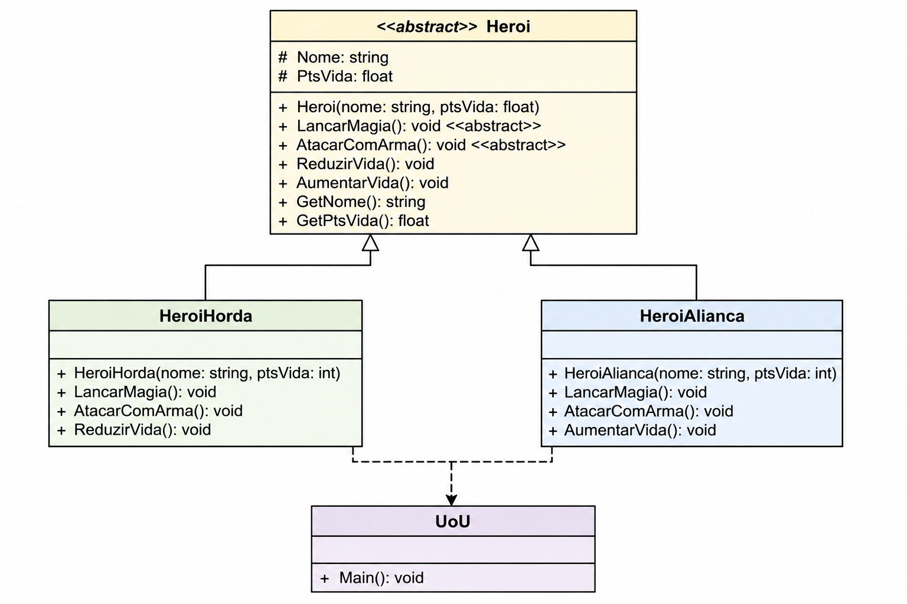

# 🛡️ Projeto UoU - Heroes em C#

Projeto desenvolvido em **C#** para demonstrar conceitos fundamentais de **Programação Orientada a Objetos (POO)**, utilizando:

* Classes abstratas;
* Herança;
* Polimorfismo;
* Encapsulamento;
* Sobrescrita de métodos;
* Organização hierárquica de classes.

O projeto simula um pequeno universo de heróis dividido entre duas facções: **Horda** e **Aliança**, inspiradas em jogos de RPG.

---

# 📌 Estrutura do Projeto

```
UoU
│
├── Heroi.cs
├── HeroiHorda.cs
├── HeroiAlianca.cs
└── Program.cs
```

---

# 📖 Diagrama UML



---

# 🏗️ Arquitetura das Classes

## Classe Abstrata `Heroi`

Representa a entidade genérica de um herói.

### Atributos

* `Nome` : Nome do herói.
* `PtsVida` : Quantidade de pontos de vida.

### Métodos

| Método            | Descrição                              |
| ----------------- | -------------------------------------- |
| `LancarMagia()`   | Método abstrato para execução de magia |
| `AtacarComArma()` | Método abstrato para ataque físico     |
| `ReduzirVida()`   | Diminui os pontos de vida              |
| `AumentarVida()`  | Incrementa os pontos de vida           |
| `GetNome()`       | Retorna o nome do herói                |
| `GetPtsVida()`    | Retorna os pontos de vida              |

---

## Classe `HeroiHorda`

Especialização da classe `Heroi` que representa personagens pertencentes à facção da Horda.

Implementa:

* Lançamento de magias;
* Ataques com armas;
* Redução de pontos de vida.

---

## Classe `HeroiAlianca`

Especialização da classe `Heroi` que representa personagens pertencentes à facção da Aliança.

Implementa:

* Lançamento de magias;
* Ataques com armas;
* Recuperação de pontos de vida.

---

# 🚀 Conceitos de POO Aplicados

## Encapsulamento

Os atributos dos heróis são protegidos e acessados por métodos públicos.

```csharp
protected string Nome;
protected float PtsVida;
```

---

## Herança

As classes especializadas herdam características da classe abstrata:

```csharp
public class HeroiHorda : Heroi
public class HeroiAlianca : Heroi
```

---

## Abstração

A classe `Heroi` define comportamentos genéricos que devem ser implementados pelas subclasses:

```csharp
public abstract void LancarMagia();
public abstract void AtacarComArma();
```

---

## Polimorfismo

Cada facção implementa seus próprios comportamentos para magia e combate, permitindo diferentes execuções para os mesmos métodos.

---

# ▶️ Exemplo de Utilização

```csharp
Heroi h1 = new HeroiHorda("Thrall", 100);
Heroi h2 = new HeroiAlianca("Arthas", 120);

h1.LancarMagia();
h1.AtacarComArma();

h2.LancarMagia();
h2.AtacarComArma();
```

---

# 💻 Saída Esperada

```text
Thrall lançou uma magia da Horda.
Thrall atacou com sua arma.

Arthas lançou uma magia da Aliança.
Arthas atacou com sua arma.
```

---

# 🎯 Objetivos Educacionais

Este projeto foi desenvolvido para auxiliar no aprendizado dos seguintes tópicos:

* Programação Orientada a Objetos em C#
* Classes e Objetos
* Classes Abstratas
* Herança
* Polimorfismo
* Encapsulamento
* Sobrescrita de Métodos
* Organização de Projetos em Camadas

---

# 🛠️ Tecnologias Utilizadas

* Linguagem: C#
* Plataforma: .NET
* Paradigma: Orientação a Objetos
* IDE sugerida: Microsoft Visual Studio ou Visual Studio Code

---

# ▶️ Execução do Código

## Compilação

No diretório do projeto, execute o comando:

```bash
mcs UOU.cs Heroi.cs HeroiAlianca.cs HeroiHorda.cs -out:UOU
```

## Execução

```bash
mono UOU
```
